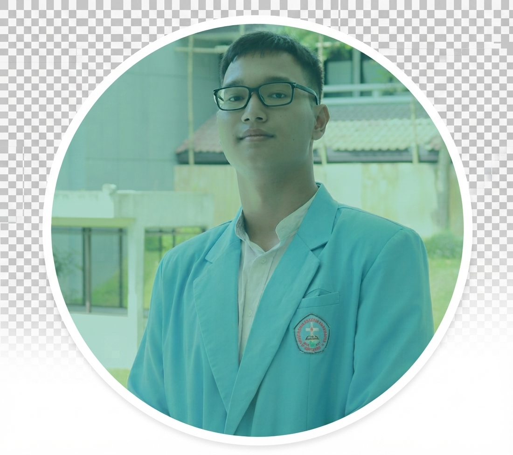

  

# Halo, Saya Khresna Mulia Putra (Khresmupu)

  
  

  

---

## 🧭 Navigasi Cepat
* [Tentang Saya](#-tentang-saya)
* [Bidang Keahlian](#-bidang-keeahlian-utama)
* [Keahlian Teknis](#-keahlian-teknis--metrik-penguasaan)
* [Proyek Unggulan](#-proyek-unggulan-utama)

---

## 🚀 Tentang Saya

Saya adalah seorang **Creative Developer** dan mahasiswa di Universitas Kristen Maranatha yang bergerak di persimpangan antara teknologi digital dan ekspresi kreatif. Fokus utama saya adalah mentransformasi penyampaian materi konvensional menjadi pengalaman yang interaktif dan intuitif melalui integrasi animasi 3D pada web.

> *"Di luar baris kode, saya mengeksplorasi dunia audio sebagai sarana bercerita. Bagi saya, baik coding maupun musik adalah alat untuk memecahkan masalah: yang satu melalui logika fungsional, yang lainnya melalui resonansi emosional. Melalui khresmupu, saya berkomitmen menciptakan solusi digital yang tidak hanya bekerja dengan baik, tetapi juga memiliki nilai edukatif dan estetika yang mendalam."*

### 🎓 Pendidikan & Fokus Utama
* **Institusi:** Universitas Kristen Maranatha (Bandung, Indonesia)
* **Fokus Utama:** 
  * Front-End Development
  * 3D Web Integration
  * Digital Music Production

### 🌐 Profil Eksternal
* [Music](https://portofolio-khresmupu.netlify.app/musik/) — Musik-musik yang telah dirilis pada platform digital.
* [Swimcloud](https://www.swimcloud.com/swimmer/1323287/) — Catatan prestasi dalam dunia internasional.
* [Chess](https://www.chess.com/member/khresmupu) — Catatan peringkat dalam setiap permainan.
* [Olimpiadeku](https://olimpiadeku.com/leaderboard/7adaf937-bb20-45bd-871d-9daccfe4f498) — Riwayat kompetisi sains dan medali yang telah diraih dalam lomba materi dasar.
* [Academia Profile](https://independent.academia.edu/KMuliaPutra) — Publikasi dan dokumentasi penelitian pengembangan website pembelajaran renang 3D serta karya ilmiah lainnya.

---

## 🛠 Bidang Keahlian Utama

<table>
<tr>
  <td width="33%" align="center"><b>🌐 Web Development</b></td>
  <td width="33%" align="center"><b>🎬 Integrasi Animasi 3D</b></td>
  <td width="33%" align="center"><b>🎵 Produksi Musik Digital</b></td>
</tr>
<tr>
  <td>
    Mengembangkan website modern yang responsif dengan struktur kode yang rapi, interaktif, serta mudah dipelihara.  
    <b>Tech Stack:</b> 
    HTML5 • CSS3 • JavaScript • Tailwind CSS • jQuery • PHP • SQL
  </td>
  <td>
    Menggabungkan aset tiga dimensi hasil pemodelan Blender ke dalam website untuk media pembelajaran interaktif.  
    <b>Pengalaman:</b> 
    • Animasi edukasi 3D 
    • Visualisasi objek interaktif 
    • Integrasi multimedia web 
    • Optimasi performa render
  </td>
  <td>
    Menciptakan musik instrumental orisinal dengan pendekatan storytelling untuk membangun suasana.  
    <b>Perangkat & Alat:</b> 
    BandLab • Walk Band 
    Komposisi instrumental • Soundscape
  </td>
</tr>
</table>

---

## 📊 Keahlian Teknis & Metrik Penguasaan

* **Web Frontend & Responsive Design** — `Advanced • 80%`  
  Menguasai HTML, CSS, JavaScript, serta perancangan Responsive Web Design yang optimal dan adaptif di semua ukuran layar perangkat.
* **UI / UX Design** — `Advanced • 80%`  
  Merancang antarmuka pengguna yang bersih, estetis, dan berpusat pada kenyamanan navigasi (user-friendly).
* **Backend (PHP) & SQL Database** — `Intermediate • 50%`  
  Berpengalaman dalam pengembangan fungsionalitas sisi server menggunakan PHP serta perancangan basis data relasional SQL.
* **Blender 3D & 3D Web** — `Advanced • 75%`  
  Membuat pemodelan objek dan animasi 3D untuk diintegrasikan ke dalam ekosistem web interaktif sebagai media edukasi.
* **Music Production** — `Creative • 65%`  
  Menciptakan komposisi musik instrumental dengan pendekatan emosional dan storytelling menggunakan BandLab / Walk Band.
* **Problem Solving & Logical Thinking** — `Analytical • 70%`  
  Memiliki kemampuan berpikir logis dalam menganalisis masalah, menyusun alur sistem, serta mengoptimalkan struktur program agar efektif.

---

## 💼 Proyek Unggulan Utama

<b>🏊‍♂️ 3D Swimming Learning Website (Tirta Sapa) - 2025</b>

> Website pembelajaran renang berbasis animasi 3D yang dikembangkan melalui riset mendalam.

* **Purpose:** Menyediakan media edukasi visual yang interaktif dan mudah dipahami untuk mempelajari berbagai teknik dan gaya renang secara tepat.
* **Key Features:** Animasi Gaya Renang, Kontrol Interaktif, Deskripsi Teknik Detail.
* **Development Team:** Khresmupu, andreasanandeto-web.
* **Technology:** HTML / CSS / JS, Blender 3D.
* **Links:** [Kunjungi Website](https://tirtasapa.netlify.app/) | [Baca Case Study](https://www.academia.edu/165429827/PENGEMBANGAN_WEBSITE_PEMBELAJARAN_RENANG_3D)

<b>🏛️ Cultural Education Website (Jogja Culture) - 2026</b>

> Platform web interaktif yang dirancang untuk memperkenalkan dan melestarikan ragam kebudayaan Yogyakarta.

* **Purpose:** Menyediakan panduan digital interaktif mengenai wisata, kekayaan budaya, jejak sejarah, serta peta navigasi kawasan Jogjakarta secara informatif dan menarik.
* **Key Features:** Interactive Mataram History, Cultural Heritage Catalog, Culinary Exploration Guide.
* **Development Team:** Khresmupu, stseven77, RolandMF.
* **Technology:** HTML / CSS / JS, Tailwind CSS, jQuery.
* **Links:** [Kunjungi Website](https://jogjaculture.netlify.app/)

<b>💰 Financial Management Web (KasKeuangan Khresmupu) - 2026</b>

> Website pencatatan dan pengelolaan kas keuangan yang memudahkan pengguna dalam memantau pemasukan dan pengeluaran.

* **Purpose:** Menyediakan sistem manajemen dan pencatatan keuangan kas digital yang aman berbasis database untuk memantau transaksi secara akurat dan real-time.
* **Key Features:** Pencatatan Arus Kas Berbasis Database, Rekapitulasi & Laporan Otomatis, Manajemen Data Transaksi Aman.
* **Development Team:** Tim Pengembang Internal / Mandiri.
* **Technology:** HTML / CSS / JS, PHP, SQL.
* **Links:** [Kunjungi Website](https://kaskeuangan.wuaze.com/)

---

  
© 2026 Portfolio Khresmupu. All Rights Reserved.

