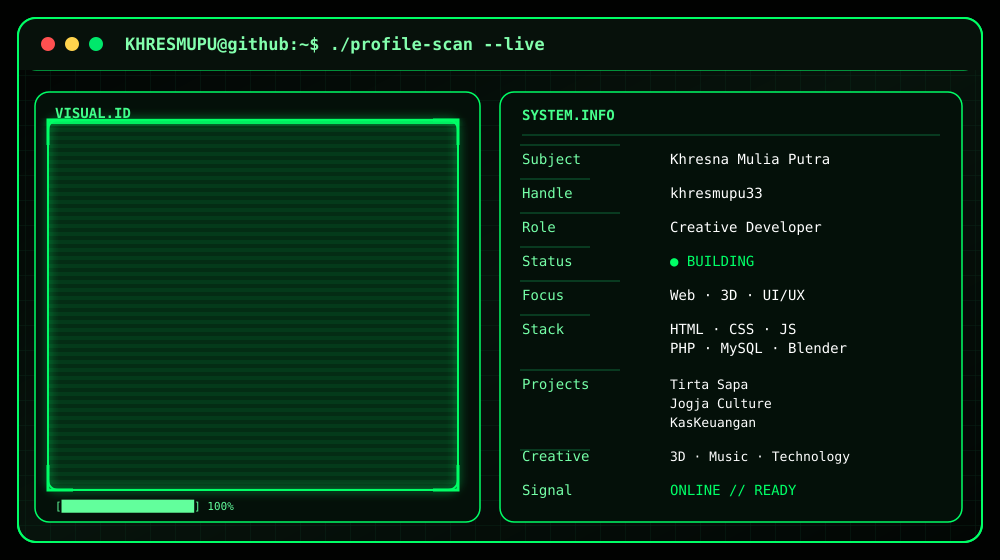

<p align="center">
  
</p>
<div align="center">
# 🟢 KHRESMUPU

### Khresna Mulia Putra

**Creative Developer · Web Developer · 3D Web Integrator · Digital Music Producer**


<br>


<br>
<a href="https://portofolio-khresmupu.netlify.app/">

</a>
<a href="https://github.com/khresmupu33">

</a>
<a href="mailto:khresmupu@gmail.com">

</a>

</div>

---

## 🟢 `$ whoami`

<div align="center">



</div>


 **Creative Developer** yang menggabungkan teknologi, desain visual, 3D, dan musik untuk membangun pengalaman digital yang interaktif.

Saya adalah mahasiswa **Universitas Kristen Maranatha** yang memiliki ketertarikan pada pengembangan website, integrasi animasi 3D, UI/UX, dan produksi musik digital.

Saya percaya bahwa sebuah website tidak hanya harus **berfungsi**, tetapi juga harus mampu **menyampaikan pengalaman dan cerita**.

```text
┌─────────────────────────────────────────────────────┐
│                                                     │
│   CODE        → Logic & Function                    │
│   DESIGN      → Visual & Experience                 │
│   3D          → Interaction & Education             │
│   MUSIC       → Emotion & Storytelling              │
│                                                     │
│   = CREATIVE DIGITAL EXPERIENCE                     │
│                                                     │
└─────────────────────────────────────────────────────┘
```

---

## 🟩 `> Current Focus`

```diff
+ Web Development
+ Front-End Development
+ UI / UX Design
+ 3D Web Integration
+ Blender 3D
+ PHP & SQL
+ Digital Music Production
+ Creative Technology
```

---

## 🛠️ Tech Stack

<div align="center">

### 🌐 Web Development


### 🎨 Design & 3D


### ⚙️ Tools & Development


</div>

---

## 📊 Skill Matrix

| Skill                    | Level | Focus                                       |
| ------------------------ | :---: | ------------------------------------------- |
| 🌐 Front-End Development | `80%` | HTML · CSS · JavaScript · Responsive Design |
| 🎨 UI / UX Design        | `80%` | Interface · Layout · User Experience        |
| 🧊 Blender & 3D Web      | `75%` | Modeling · Animation · Web Integration      |
| 🧠 Problem Solving       | `70%` | Logic · System Flow · Optimization          |
| 🎵 Music Production      | `65%` | Instrumental · Soundscape · Storytelling    |
| 🗄️ PHP & SQL            | `50%` | Backend · Database · CRUD                   |

```text
Frontend              ████████████████░░░░ 80%
UI / UX               ████████████████░░░░ 80%
Blender / 3D Web      ███████████████░░░░░ 75%
Problem Solving       ██████████████░░░░░░ 70%
Music Production      █████████████░░░░░░░ 65%
PHP / SQL             ██████████░░░░░░░░░░ 50%
```

---

# 🚀 Featured Projects

## 🏊‍♂️ Tirta Sapa

### `3D Swimming Learning Website`

> Interactive educational website that combines **web technology + Blender 3D animation** to create a visual swimming-learning experience.

**Highlights**

* 🏊 Interactive swimming technique animations
* 🎬 3D educational visualization
* 🎮 Interactive controls
* 📚 Detailed technique explanations
* 📱 Responsive web interface
* ⚡ Optimized web experience

**Stack**

`HTML` `CSS` `JavaScript` `Blender 3D`

**Team**

`Khresmupu` · `andreasanandeto-web`

<div align="center">

[](https://tirtasapa.netlify.app/)
[](https://www.academia.edu/165429827/PENGEMBANGAN_WEBSITE_PEMBELAJARAN_RENANG_3D)

</div>

---

## 🏛️ Jogja Culture

### `Interactive Cultural Education Website`

> Digital platform designed to introduce and preserve the cultural heritage of **Yogyakarta** through an interactive web experience.

**Highlights**

* 🏯 Mataram history exploration
* 🗺️ Interactive cultural map
* 🍜 Culinary exploration
* 🏛️ Cultural heritage catalog
* 📖 Educational content
* 🎨 Modern interactive interface

**Stack**

`HTML` `CSS` `JavaScript` `Tailwind CSS` `jQuery`

**Team**

`Khresmupu` · `stseven77` · `RolandMF`

<div align="center">

[](https://jogjaculture.netlify.app/)

</div>

---

## 💰 KasKeuangan Khresmupu

### `Financial Management Web Application`

> Web-based financial management system designed to help users record, organize, and monitor cash flow digitally.

**Highlights**

* 💵 Income & expense recording
* 📊 Financial recap
* 🗄️ Database-based transactions
* 🔐 Secure data management
* 📑 Automated reports
* 🔎 Transaction history
* 📈 Financial monitoring

**Stack**

`HTML` `CSS` `JavaScript` `PHP` `MySQL`

<div align="center">

[](https://kaskeuangan.wuaze.com/)
[](https://www.academia.edu/171337889/Aplikasi_Pencatatan_Keuangan_Kas_Berbasis_Web_Struktur_and_Mutasi_Ganda_Studi_Kasus_KasKeuangan_Khresmupu?source=swp_share)

</div>

---

# 🎵 Beyond Code

Programming isn't my only way of creating.

I also create **original instrumental music** under the name **Khresmupu**.

My approach to music is similar to programming:

```text
Music
  ↓
Emotion
  ↓
Story
  ↓
Atmosphere
  ↓
Experience
```

🎧 **Digital Music**

[](https://portofolio-khresmupu.netlify.app/musik/)

---

# 🌐 Explore My Profiles

<div align="center">

| Platform           | Purpose                             |
| ------------------ | ----------------------------------- |
| 🌐 **Portfolio**   | Web development & creative projects |
| 🎵 **Music**       | Original instrumental compositions  |
| 🏊 **SwimCloud**   | Swimming achievements               |
| ♟️ **Chess.com**   | Chess activity                      |
| 🏆 **Olimpiadeku** | Competition & achievement records   |
| 📚 **Academia**    | Research & academic documentation   |

</div>

---


# 🟢 Currently Building

```text
╭──────────────────────────────────────────────╮
│                                              │
│   💻 Web Applications                        │
│   🎨 Interactive Digital Experiences         │
│   🧊 3D Web Learning Media                  │
│   💰 Financial Technology for UMKM           │
│   🎵 Original Instrumental Music             │
│                                              │
╰──────────────────────────────────────────────╯
```

---

# 🤝 Let's Connect

<div align="center">

**Interested in web development, creative technology, 3D web, or digital projects?**

Let's build something meaningful.

<br>

<a href="https://portofolio-khresmupu.netlify.app/">

</a>

<a href="mailto:khresmupu@gmail.com">

</a>

<a href="https://github.com/khresmupu33">

</a>

<br><br>

`Code • Create • Explore • Improve`

<br>

**© 2026 Khresmupu**

</div>
<p align="center">
  
</p>
